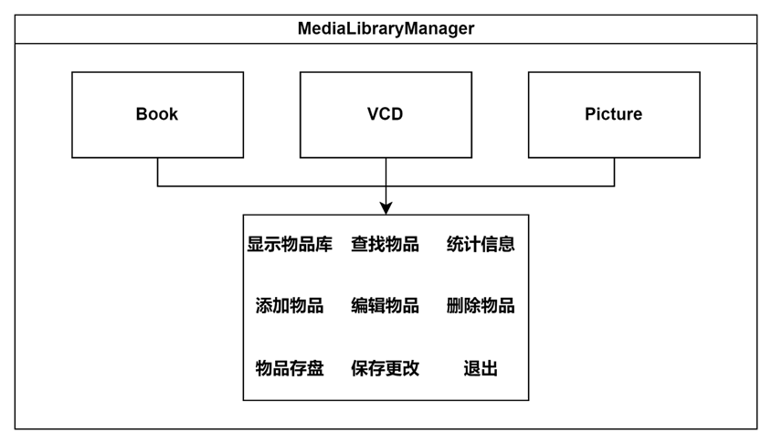
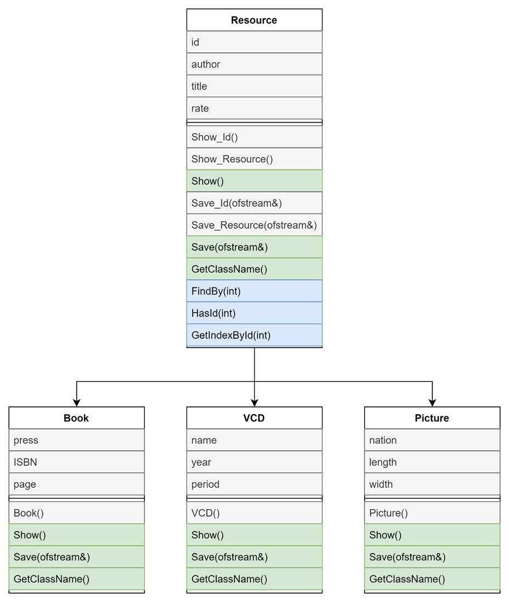
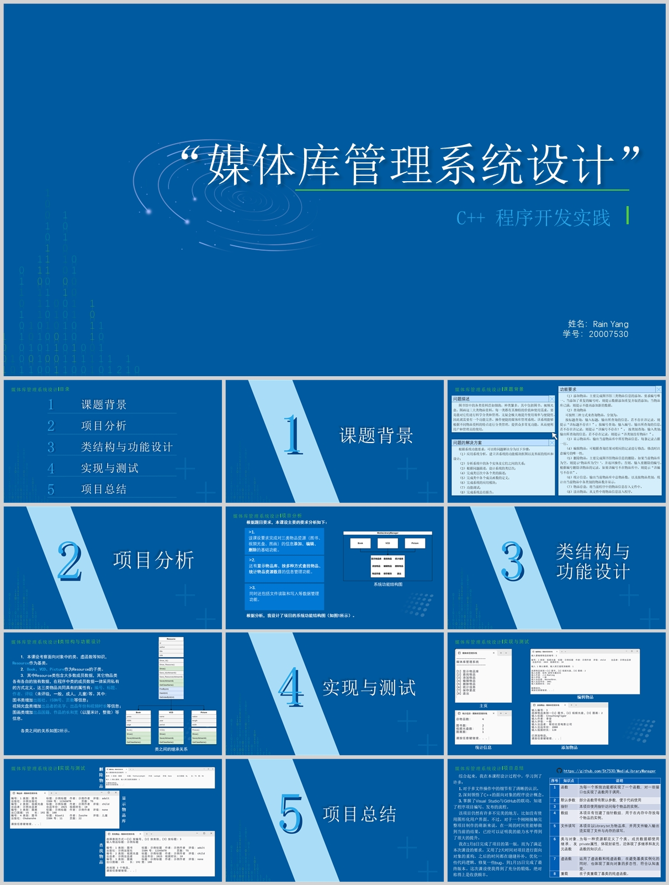

# MediaLibraryManager

C++ 程序开发实践题目——“媒体库管理系统设计”

## 问题描述 

图书馆中的资料很多，如果能分类对其资料流通进行管理，将会带来很多方便，因此需要有一个媒体库管理系统。

图书馆共有三大类物品资料：图书、视频光盘、图画。

这三类物品共同具有的属性有：编号、标题、作者、评级（未评级，一般，成人，儿童）等。其中图书类增加出版社、ISBN 号、页数等信息；视频光盘类增加出品者的名字、出品年份和视频时长等信息；图画类增加出品国籍、作品的长和宽（以厘米计，整数）等信息。

## 已实现功能

1. 显示物品库
2. 查找物品
3. 添加物品
4. 编辑物品
5. 删除物品
6. 统计信息
7. 保存更改
8. 退出

## 运用的知识点

- 数组
- 指针
- 引用
- 类
- 派生
- 单继承
- 多态
- 虚函数
- 友元函数
- 函数重载
- 文件读写
- 默认参数
- 多文件

## 项目报告

   	
系统功能结构图

    

   	
类之间的继承关系

    

    
项目文件功能列表

    <table>
		<tr>
			<th>序号</th>
            <th>文件名</th>
            <th>说明</th>
		</tr>
		<tr>
            <td>1</td>
            <td>MediaLibraryManager.cpp</td>
            <td>程序的入口main()：自动从文件加载物品库、系统主页</td>
		</tr>
		<tr>
            <td>2</td>
            <td>Globals.h</td>
            <td>全局变量、各类的定义</td>
		</tr>
		<tr>
            <td>3</td>
            <td>Globals.cpp</td>
            <td>各类函数的实现</td>
		</tr>
		<tr>
            <td>4</td>
            <td>ShowLibrary.h</td>
            <td>显示物品库的定义</td>
		</tr>
		<tr>
            <td>5</td>
            <td>ShowLibrary.cpp</td>
            <td>显示物品库的实现</td>
		</tr>
		<tr>
            <td>6</td>
            <td>FindItem.h</td>
            <td>查找物品、HasId(int)、GetIndexById(int)、GetResourceCount(int)的定义</td>
		</tr>
		<tr>
            <td>7</td>
            <td>FindItem.cpp</td>
            <td>查找物品的实现</td>
		</tr>
		<tr>
            <td>8</td>
            <td>AddItem.h</td>
            <td>添加物品的定义</td>
          </tr>
          <tr>
            <td>9</td>
            <td>AddItem.cpp</td>
            <td>添加物品的实现</td>
		</tr>
		<tr>
            <td>10</td>
            <td>EditItem.h</td>
            <td>编辑物品的定义</td>
		</tr>
		<tr>
            <td>11</td>
            <td>EditItem.cpp</td>
            <td>编辑物品的实现</td>
		</tr>
		<tr>
            <td>12</td>
            <td>DeleteItem.h</td>
            <td>删除物品的定义</td>
		</tr>
		<tr>
            <td>13</td>
            <td>DeleteItem.cpp</td>
            <td>删除物品的实现</td>
		</tr>
		<tr>
            <td>14</td>
            <td>ShowStats.h</td>
            <td>统计信息的定义</td>
		</tr>
		<tr>
            <td>15</td>
            <td>ShowStats.cpp</td>
            <td>统计信息的实现</td>
		</tr>
        <tr>
            <td>16</td>
            <td>SaveLibrary.h</td>
            <td>保存更改的定义</td>
        </tr>
        <tr>
            <td>17</td>
            <td>SaveLibrary.cpp</td>
            <td>保存更改的实现</td>
        </tr>
        <tr>
            <td>18</td>
            <td>Exit.h</td>
            <td>退出的定义</td>
        </tr>
        <tr>
            <td>19</td>
            <td>Exit.cpp</td>
            <td>退出的实现</td>
        </tr>
	</table>

    
答辩 PPT

     
    <a href="README.assets/媒体库管理系统设计.pptx">媒体库管理系统设计.pptx</a>
      
    

## 最后

初版代码甚至没有用到面向对象😭，害得我之后又[改了几百行来完成对面向对象的重构](https://github.com/St7530/MediaLibraryManager/commit/a4db060c95fb3ead7ac4ccc2e0dc4afd04d66f40)，好在最终项目的答辩挺顺利的。

本仓库使用 [MIT License](LICENSE) 开源。如果有帮到你，欢迎点个 Star 或者 Follow ❤️